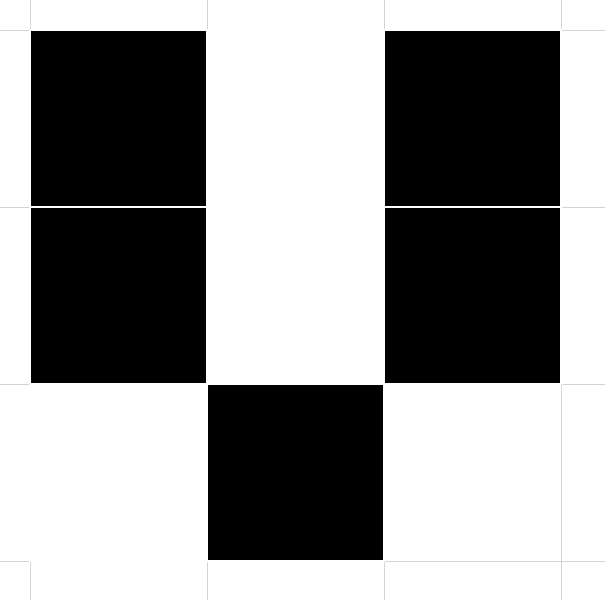
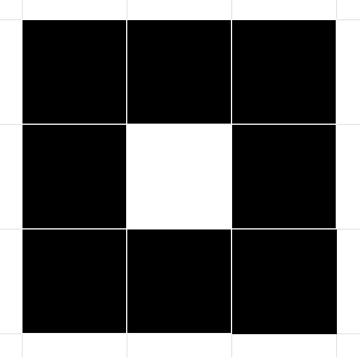

# simple-character-recognition
Một cái mạng đơn giản nhận dạng hai chữ cái, hai chữ cái biểu diễn bằng hai ma trận 3x3. Đây là cái bài trong đề thi Cơ sở trí tuệ nhân tạo, mình code thử

Features
--------

Thiết kế mạng neural nhân tạo nhận diện hai mẫu
------------

Installation/ Running
------------

For quickly just open the notbook.ipynb and look at the result

For locally

1. Clone project

2. Open with your text editor like Visual Code <#

Contribute
----------

- Issue Tracker: github.com/nhutnamhcmus/simple-character-recognition/issues <3
- Source Code: github.com/nhutnamhcmus/simple-character-recognition <3

Support
-------

If you are having issues, please let us know.  
We have a mailing list located at: lenam.fithcmus@gmail.com

License
-------

The project is licensed under the MIT license.
